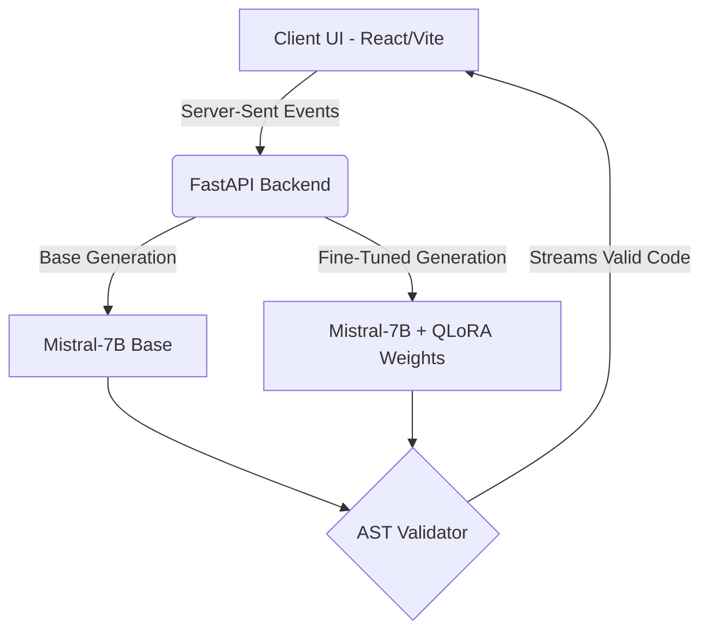

# ⚡️ StyleForge: Fine-Tuned AI Code Assistant


StyleForge is a full-stack, end-to-end Machine Learning web application designed to evaluate and compare Large Language Models (LLMs). It features a custom QLoRA fine-tuned Mistral-7B model trained specifically on 18,000 high-quality Python instructions to generate robust, idiomatic, and production-ready Python code.

> **💡 Note on Live Demo & Cloud Constraints:**
> The live deployment of this application is running in **Simulation (Mock) Mode** because hosting a 7B-parameter LLM with GPU memory requires expensive cloud infrastructure. However, the complete ML training pipeline, QLoRA weights, and Apple MLX inference engine are included in this repository. To run the *actual* model locally on Apple Silicon, see the Local Installation guide below. This architecture demonstrates an understanding of cloud economics while showcasing the full stack capabilities!

---

## 🚀 Key Features

* **Custom ML Pipeline:** Fine-tuned `Mistral-7B-Instruct` using QLoRA on a curated dataset of 18,000 Python coding problems.
* **Optimized Apple MLX Inference:** The backend utilizes Apple's `mlx-lm` framework to run the 7B model locally on M-Series MacBooks with incredible speed and unified memory efficiency.
* **Side-by-Side Streaming:** A real-time React UI that streams tokens via Server-Sent Events (SSE) to compare the Base Model against the Fine-Tuned Model simultaneously.
* **AST Syntax Validation:** The backend automatically parses the generated Python code using the `ast` module to ensure syntactic correctness before presenting it to the user.
* **Production-Ready DevOps:** Containerized with a multi-stage Dockerfile that compiles the React frontend and serves it directly through FastAPI on a single port.

## 🏗️ Architecture



## 🛠️ Local Installation (Running the Real Model)

To run the full model natively on your Mac (requires Apple Silicon M1/M2/M3 and at least 16GB RAM):

### 1. Clone & Setup
```bash
git clone https://github.com/YOUR_USERNAME/StyleForge.git
cd StyleForge
```

### 2. Backend (FastAPI + MLX)
```bash
cd server
python -m venv .venv
source .venv/bin/activate
pip install -r requirements.txt

# Disable mock mode to use the real weights!
export USE_MOCK=false
python main.py
```

### 3. Frontend (React)
Open a new terminal window:
```bash
cd frontend
npm install
npm run dev
```
Visit `http://localhost:5173` to see the live UI!

## 🖥️ Nvidia GPU / Linux (PyTorch)
The default backend uses Apple's `mlx-lm` for M-series chips. If you are on Linux or Windows with an Nvidia GPU, you can easily swap the inference engine to use HuggingFace Transformers:
1. `pip install torch transformers accelerate`
2. Update `server/model_loader.py` to load the weights using `AutoModelForCausalLM.from_pretrained(..., device_map="auto")`.
3. The rest of the FastAPI and React application remains exactly the same!

## 🐳 Docker Deployment (Mock Mode)
If you want to deploy this to a cloud provider (like Render, AWS, or Google Cloud) without paying for a GPU, you can use the included Dockerfile. It will automatically build the frontend and serve it via FastAPI on port 8000.

```bash
docker build -t styleforge .
docker run -p 8000:8000 -e USE_MOCK=true styleforge
```

## 📊 Training Details
The model was fine-tuned on Kaggle using PyTorch and HuggingFace's PEFT library. 
* **Dataset:** `python_code_instructions_18k_alpaca`
* **Technique:** 4-bit Quantization (QLoRA)
* **Epochs:** 1
* *(Include a link to your Kaggle Notebook here!)*
